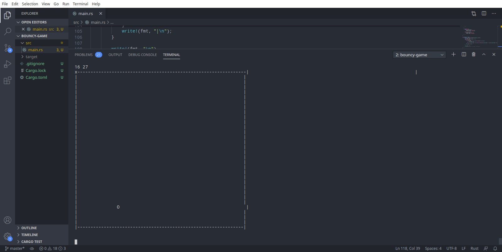

# Rust-bouncygame
This is just a demo command line bouncy game  made while Learning Rust programming

## Note
I made this bouncygame through following Rust Crash course tutorial , 
To check the full tutorial please check out on [Make a bouncy game](https://www.snoyman.com/blog/2018/10/rust-crash-course-02-basics-of-ownership) 

## Requiremenst

To successful run this code , you need to have Rust and Cargo installed on your Machine 

[CLICK HERE](https://www.rust-lang.org/learn/get-started) fo instalation guide 


## Getting started 

Just clone the repo and use cargo to run the code as shown below 

```bash
    $ git clone https://github.com/Kalebu/Rust-bouncygame
    $ cd Rust-bouncygame
    Rust-bouncygame->$ cargo run 
```

## Output 
 
 Now you're game should be running bouncing balls on the command line 
 display as shown in picture below 

 


 ``Well Thanks , Let's Oxidize the world together``